# Dogfood Report: Ohara Living Diagram

| Field | Value |
|-------|-------|
| **Date** | 2026-08-04 |
| **App URL** | http://127.0.0.1:8217/?cache=v12 |
| **Session** | ohara-blind-v12 |
| **Scope** | Blind first-use adversarial pass: onboarding, assembly, reference, responsive state, persistence, offline behavior |

## Summary

| Severity | Count |
|----------|-------|
| Critical | 0 |
| High | 0 |
| Medium | 8 |
| Low | 1 |
| **Total** | **9** |

## Issues

### ISSUE-001: First instructional controls begin below the initial desktop viewport

| Field | Value |
|-------|-------|
| **Severity** | medium |
| **Category** | ux |
| **URL** | http://127.0.0.1:8217/?cache=v12 |
| **Repro Video** | N/A |

**Description**

At 1440×1000, the initial page spends the viewport on branding, introductory copy, style selection, and the mode switch. The first Length controls and persistent navigation are below the fold, so a first-time learner must infer that scrolling is required before the promised interactive guide becomes usable.

**Repro Steps**

1. Open the app in a fresh 1440×1000 viewport and observe that the interactive lesson controls are outside the initial viewport.
   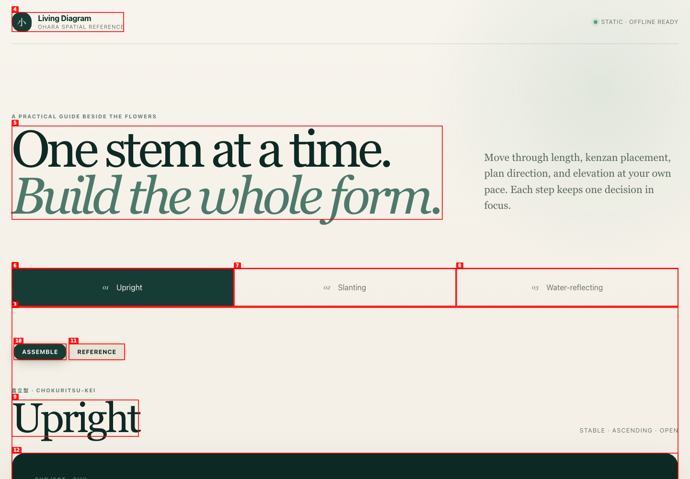

---

### ISSUE-009: Mirrored assembly contradicts the unmarked standard-orientation Reference

| Field | Value |
|-------|-------|
| **Severity** | medium |
| **Category** | content / ux |
| **URL** | http://127.0.0.1:8217/?cache=v12 |
| **Repro Video** | videos/issue-009-repro.webm |

**Description**

After mirroring Water-reflecting, Subject Plan reads “45° right of container front.” Switching directly to Reference shows “45° left of front,” but Reference does not state that it has returned to standard orientation. The adjacent modes present opposite instructions for the same active style.

**Repro Steps**

1. In Water-reflecting Assemble, mirror the Kenzan view and advance to Subject → Plan; observe `45° right of container front`.
   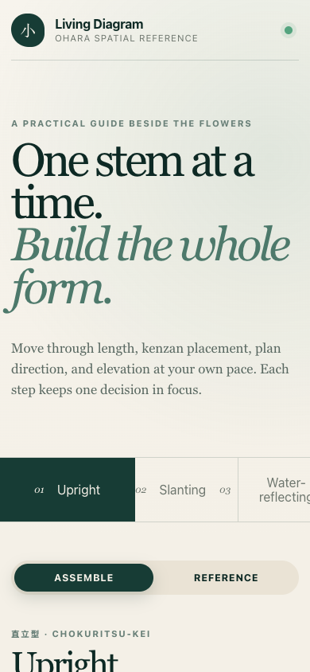
2. Select Reference and view the Subject row.
3. **Observe:** Reference says `45° left of front` without explaining the orientation change.
   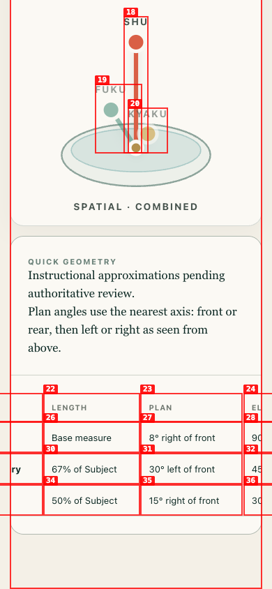

---

### ISSUE-008: Back and Next are not persistently available in the mobile lesson

| Field | Value |
|-------|-------|
| **Severity** | medium |
| **Category** | ux / responsive |
| **URL** | http://127.0.0.1:8217/?cache=v12 |
| **Repro Video** | N/A |

**Description**

At 390×844, aligning the adaptive lesson header to the viewport leaves Next below the viewport (`top≈1455px` in the reproduced Length phase). The learner must scroll through the controls and diagram before navigation appears. The navigation becomes sticky only after its natural position is reached; it is not persistently available while reading the phase.

**Repro Steps**

1. Open Assemble at 390×844 and align the Subject → Length header to the viewport.
2. **Observe:** Back/Next are absent; Next remains below the viewport.
   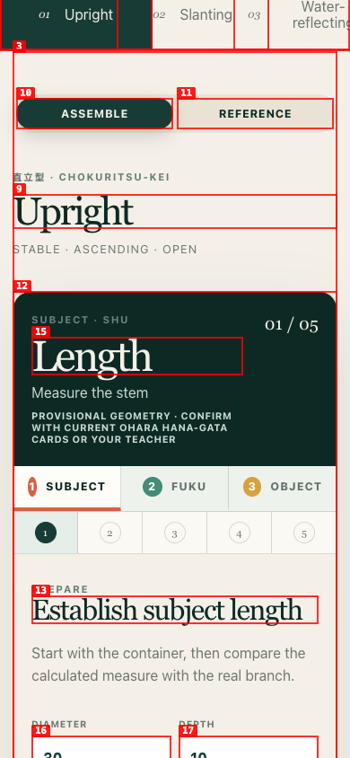

---

### ISSUE-007: Reference exposes nine controls with duplicate accessible names

| Field | Value |
|-------|-------|
| **Severity** | medium |
| **Category** | accessibility |
| **URL** | http://127.0.0.1:8217/?cache=v12 |
| **Repro Video** | N/A |

**Description**

Each of the three Reference projections makes all three stems keyboard-focusable, producing nine buttons. Their accessible names repeat only the role (“Focus Subject stem,” etc.) and omit the projection context. A nonvisual user cannot distinguish the Plan Subject control from the Front or Spatial Subject controls before activating it.

**Repro Steps**

1. Open Reference and inspect the interactive controls; note three identical accessible names for each role.
   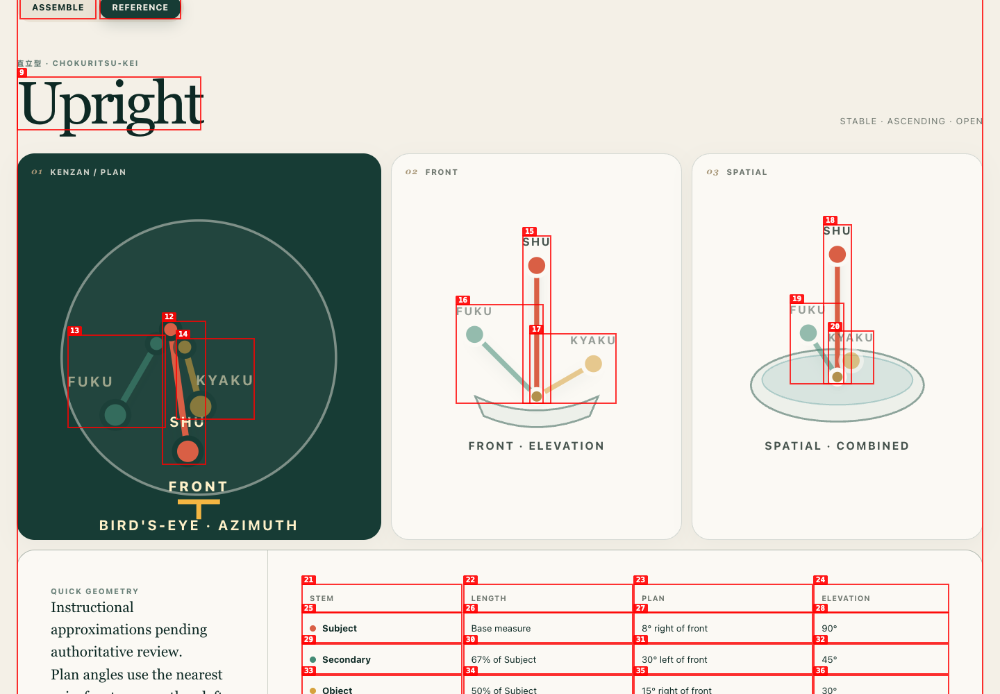
2. Accessibility-tree evidence: [issue-007-accessibility-tree.txt](screenshots/issue-007-accessibility-tree.txt)

---

### ISSUE-006: Reference resets visual focus to Subject while the learner is working on Fuku

| Field | Value |
|-------|-------|
| **Severity** | medium |
| **Category** | ux / functional |
| **URL** | http://127.0.0.1:8217/?cache=v12 |
| **Repro Video** | videos/issue-006-repro.webm |

**Description**

Switching from Fuku → Kenzan in Assemble to Reference focuses Subject in all three diagrams. The current role context is lost at the moment the learner asks for clarification. Fuku can be selected manually, but the app does not preserve or identify the role that prompted the switch.

**Repro Steps**

1. Reach Fuku → Kenzan in Assemble.
   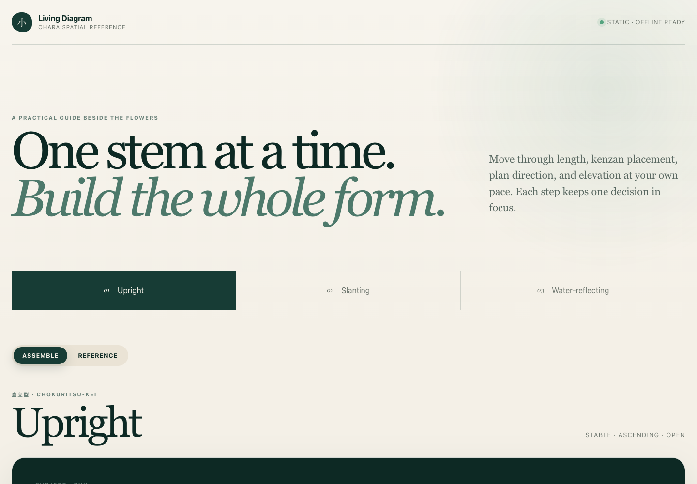
2. Select Reference.
3. **Observe:** all Reference diagrams focus Subject rather than Fuku.
   

---

### ISSUE-005: Fuku repeats the whole-Kenzan placement instead of a stem-specific action

| Field | Value |
|-------|-------|
| **Severity** | medium |
| **Category** | ux / content |
| **URL** | http://127.0.0.1:8217/?cache=v12 |
| **Repro Video** | videos/issue-005-repro.webm |

**Description**

After Subject completes the whole-Kenzan placement, moving to Fuku resets the five phases and presents “Set the whole Kenzan” again at the same container position. The role track says Fuku is active, but the phase does not teach a Fuku-specific action. A learner may believe the holder must be repositioned for every stem.

**Repro Steps**

1. Complete Subject and advance to Fuku Length.
   
2. Select Next.
3. **Observe:** Fuku repeats the whole-holder placement completed during Subject.
   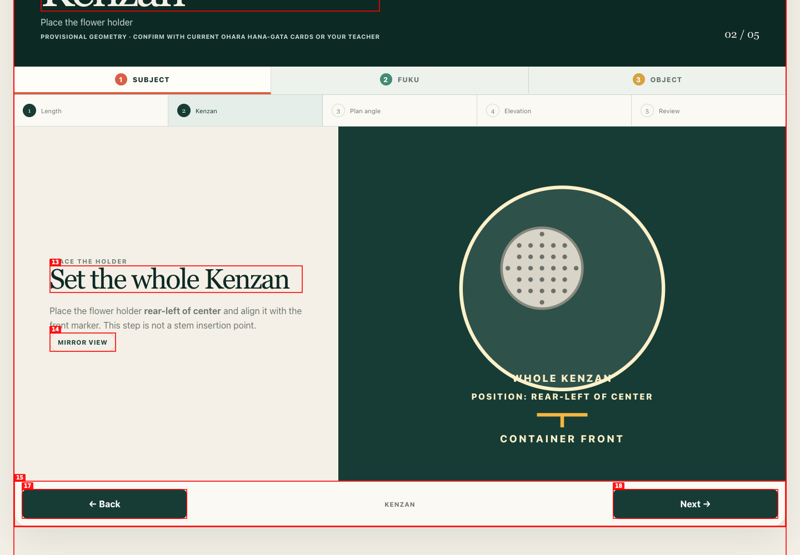

---

### ISSUE-004: Review claims an entry-point decision that the workflow explicitly omits

| Field | Value |
|-------|-------|
| **Severity** | medium |
| **Category** | content / ux |
| **URL** | http://127.0.0.1:8217/?cache=v12 |
| **Repro Video** | videos/issue-004-repro.webm |

**Description**

The Kenzan phase explicitly says it is not a stem insertion point. After Plan and Elevation, Review says “Length, entry point, plan direction, and elevation now describe one spatial decision,” but no entry-point phase or value was presented. The learner is told both that entry point is excluded and that it has been completed.

**Repro Steps**

1. On Subject → Kenzan, read that the phase is not a stem insertion point.
   
2. Advance through Plan.
   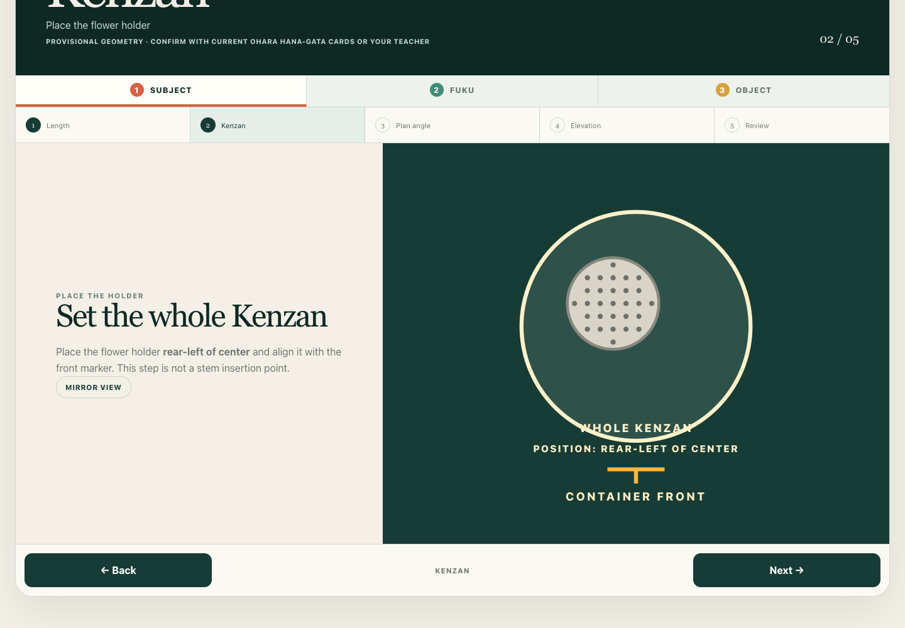
3. Advance through Elevation.
   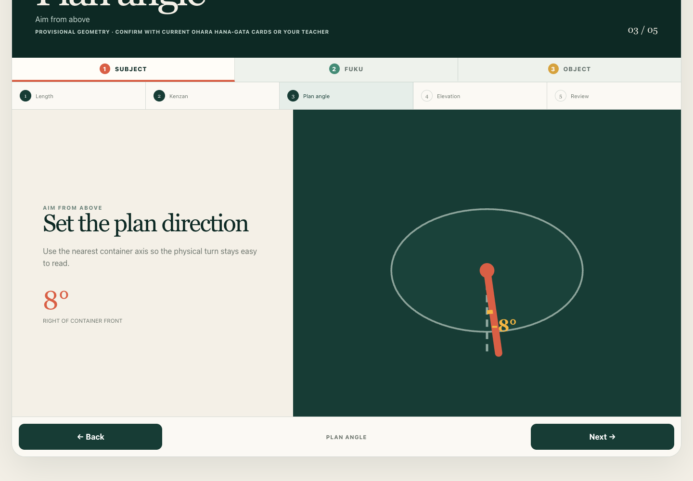
4. **Observe:** Review claims an entry-point decision that was never taught or displayed.
   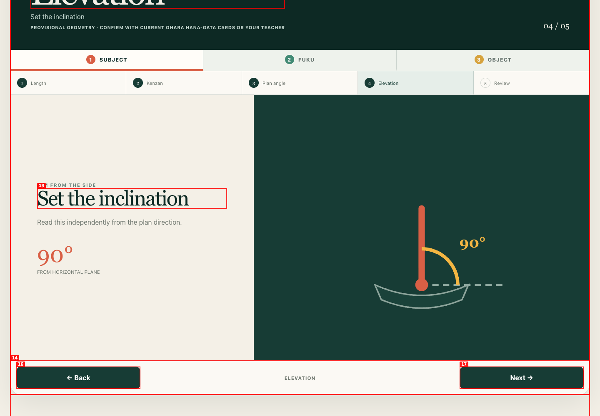

---

### ISSUE-003: Plan diagram uses an unexplained signed angle that conflicts with the prose

| Field | Value |
|-------|-------|
| **Severity** | medium |
| **Category** | content / ux |
| **URL** | http://127.0.0.1:8217/?cache=v12 |
| **Repro Video** | N/A |

**Description**

The Subject Plan screen describes the value as “8° right of container front,” while the embedded SVG labels the same turn “-8°.” No sign convention is introduced in the lesson. A first-time learner must decide whether the negative sign changes the direction or whether it should be ignored.

**Repro Steps**

1. In Upright Assemble, advance to Subject → Plan angle and compare the prose value with the SVG label.
   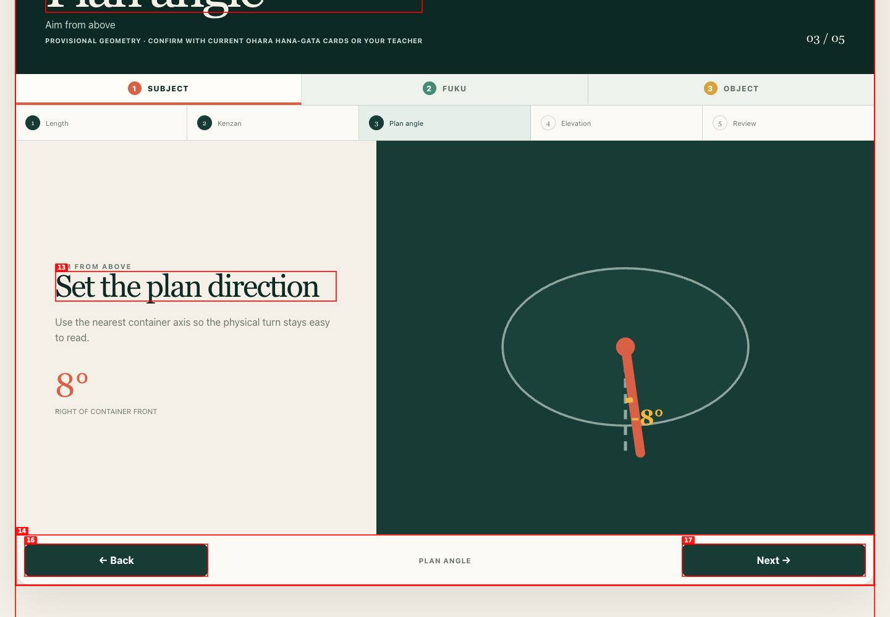

---

### ISSUE-002: Kenzan label intersects the circular container boundary

| Field | Value |
|-------|-------|
| **Severity** | low |
| **Category** | visual |
| **URL** | http://127.0.0.1:8217/?cache=v12 |
| **Repro Video** | N/A |

**Description**

On the Kenzan phase, the lower edge of the round container passes directly through the “WHOLE KENZAN” label. The location remains understandable, but the collision makes the instructional diagram look broken and weakens label legibility.

**Repro Steps**

1. Open Assemble, keep the default Upright style, and advance from Length to Kenzan.
   

---

## User-confirmed product constraint (not counted as a blind finding)

After the blind pass began, the user clarified that this exercise assumes a round, short, shallow cylindrical container. The projections should therefore remain one coherent object: circle in bird’s-eye view, shallow cylinder profile in front view, and elliptical rim plus visible shallow sidewall in spatial view. Current Reference captures should be reviewed against this constraint separately from the nine blind findings above.

