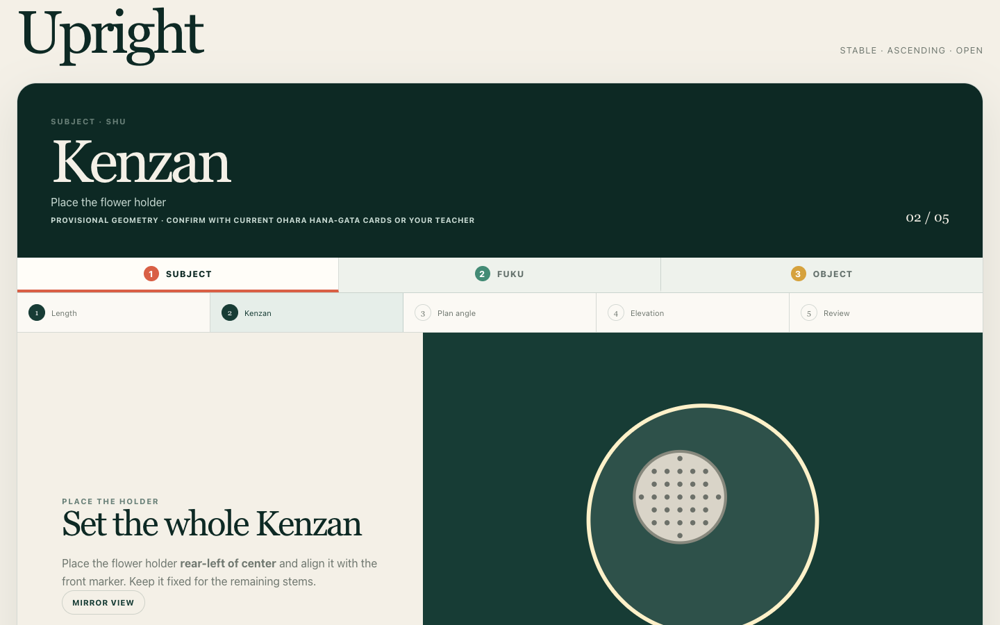
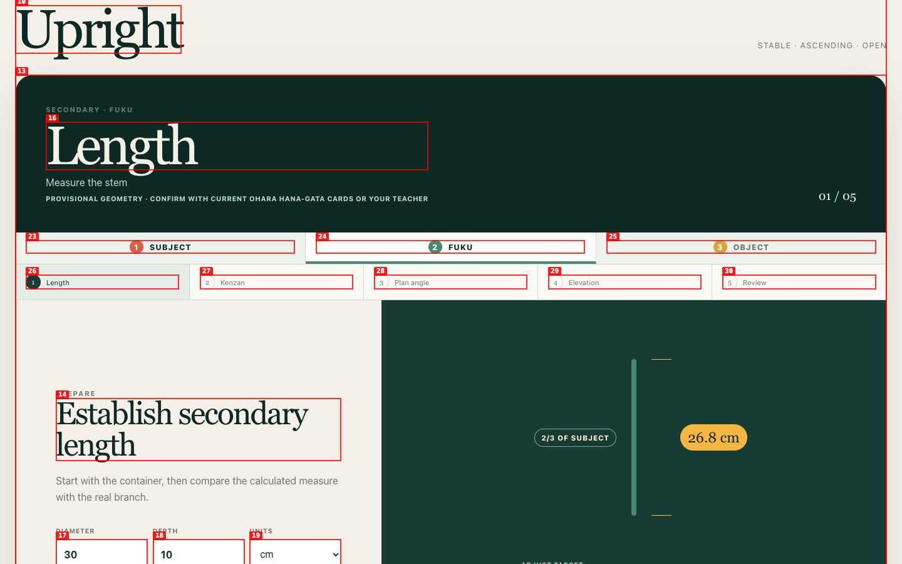
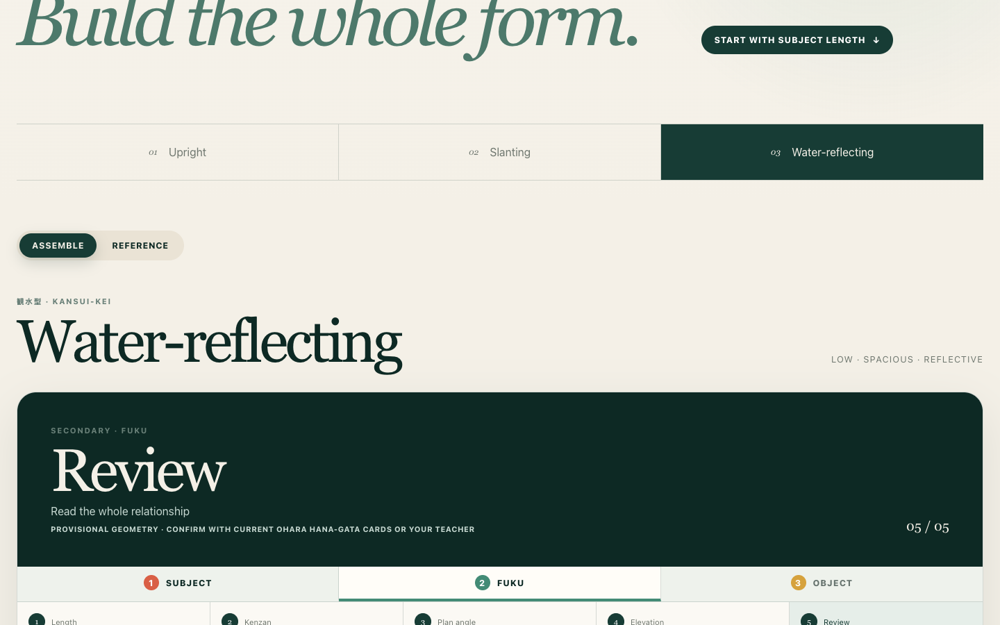
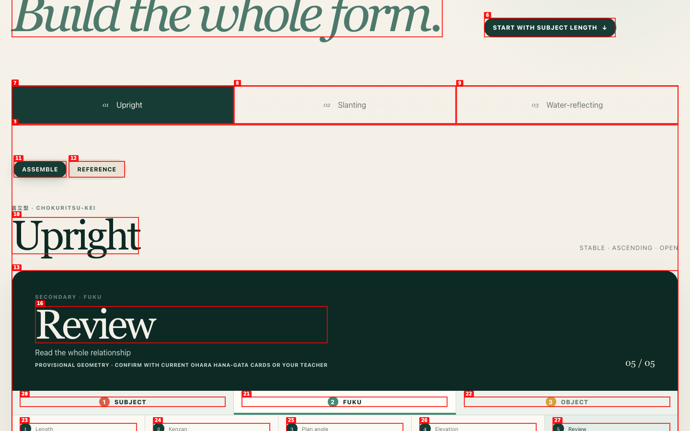
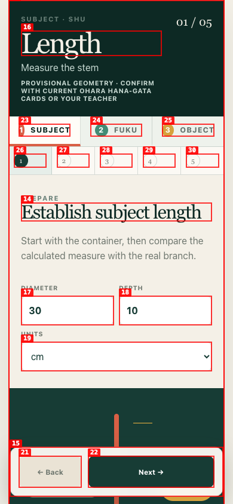
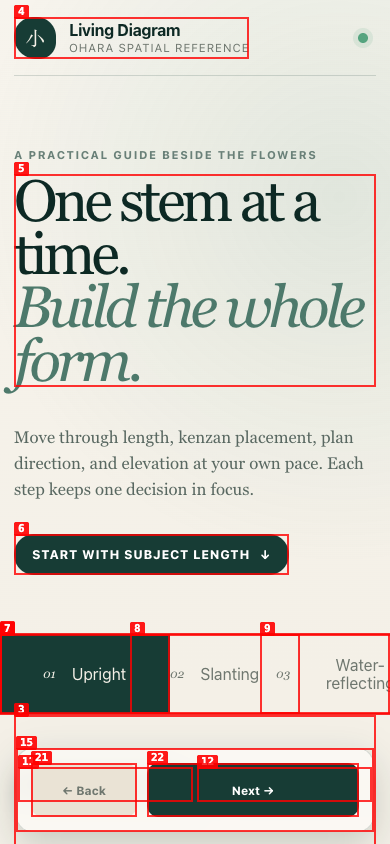
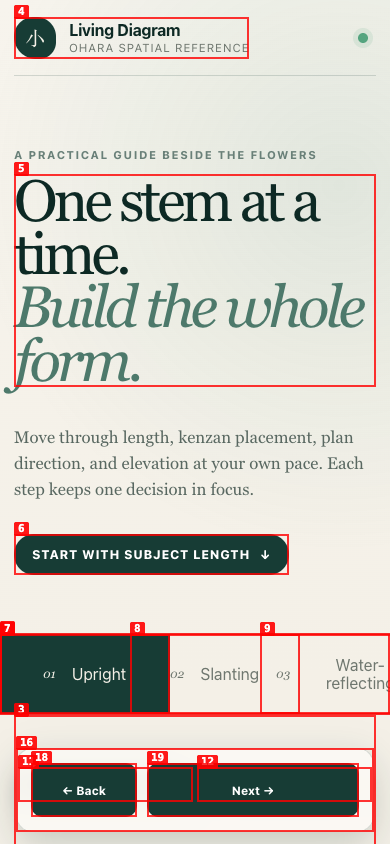
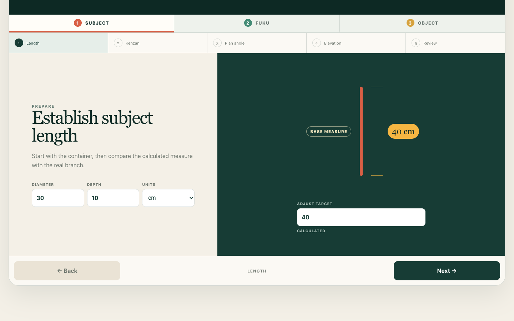
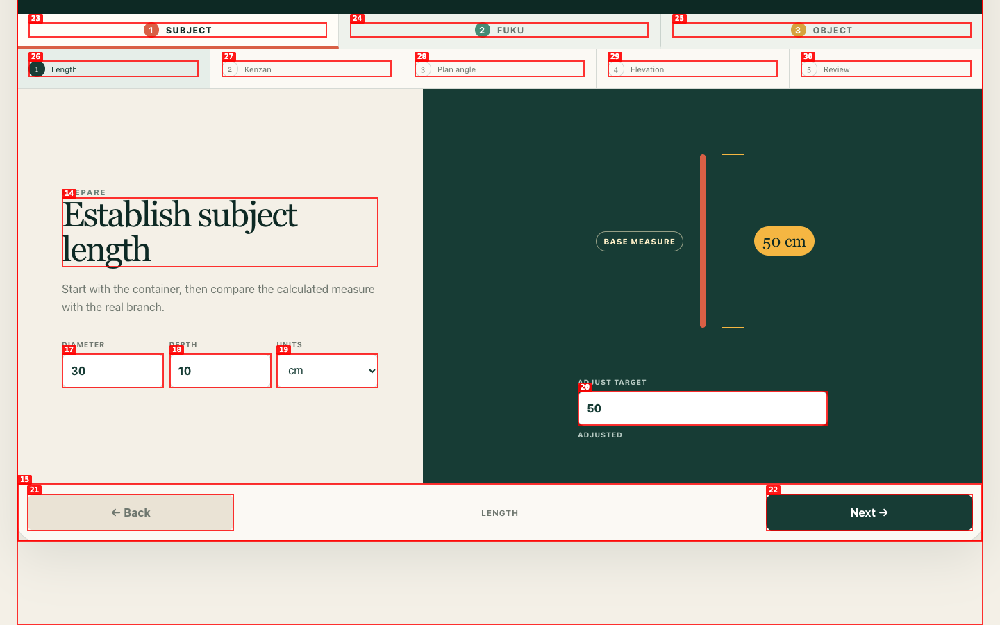
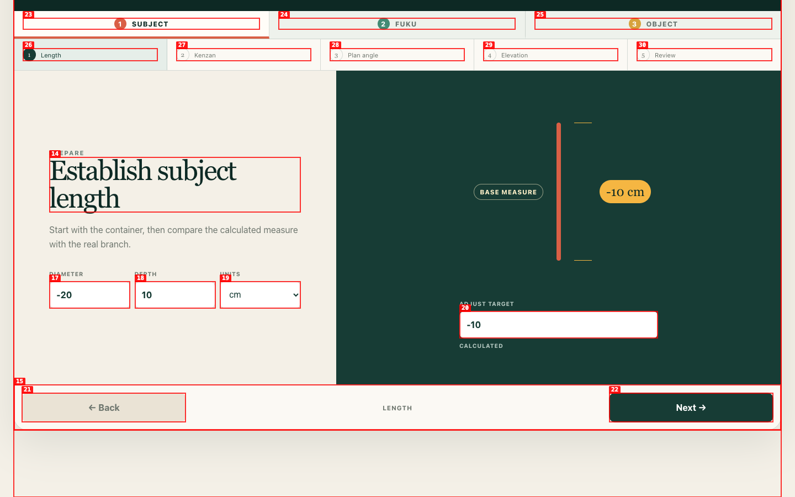

# Independent First-Use Usability Test: Ohara Living Diagram v14

| Field | Value |
|---|---|
| **Date** | 2026-08-04 |
| **URL** | http://127.0.0.1:8232/?cache=v14 |
| **Viewports** | Desktop 1440×900; mobile 390×844 |
| **Approach** | Fresh learner, black-box browser testing; no source inspected |

## Summary

| Severity | Count |
|---|---:|
| Critical | 0 |
| High | 0 |
| Medium | 6 |
| Low | 1 |
| **Total** | **7** |

The core guide is understandable and usable on desktop, and all three styles render in both Assemble and Reference. The largest first-use risk is mobile control collision: the sticky **Next** control covers **Reference** at the initial viewport and a tap on the visible Reference area advances the lesson instead. State handling and length-input semantics also have reproducible inconsistencies.

## Confirmed issues

### ISSUE-001 — Changing role unexpectedly resets the selected step

| Field | Value |
|---|---|
| **Severity** | medium |
| **Category** | functional / navigation |
| **Viewport** | desktop 1440×900 (also structurally present on mobile) |

**Expected:** Selecting another role while on Kenzan keeps Kenzan selected, especially because the control is exposed as “Go to Secondary at Kenzan.”

**Actual:** Selecting **Fuku** from Subject/Kenzan opens Secondary/**Length** (01/05).

**Reproduction**
1. In Upright → Assemble → Subject, directly select **Kenzan**. The page is at Subject/Kenzan.  
   
2. Select the **FUKU** role.
3. Observe Secondary/Fuku at **Length**, not Kenzan.  
   

This reproduced on a retry in the opposite direction as well.

---

### ISSUE-002 — Reload resets only the style, creating a mixed context

| Field | Value |
|---|---|
| **Severity** | medium |
| **Category** | functional / recovery |
| **Viewport** | desktop 1440×900 |

**Expected:** Reload either preserves the complete working context or resets it predictably.

**Actual:** From Water-reflecting → Secondary → Review, reload changes the style to **Upright** while preserving Secondary and Review. A second trial from Slanting produced the same style reset.

**Reproduction**
1. Open Water-reflecting → Assemble → Secondary → Review.  
   
2. Reload the page.
3. Observe Upright → Secondary → Review.  
   

---

### ISSUE-003 — Mobile style selector overflows the viewport

| Field | Value |
|---|---|
| **Severity** | low |
| **Category** | visual / responsive |
| **Viewport** | mobile 390×844 |

At the initial horizontal position, the three style buttons measure 170 px wide at x=0, 130, and 260. Their combined span is 430 px in a 390 px viewport, clipping the Water-reflecting end and requiring an un-signposted 40 px horizontal scroll. Adjacent button bounds also overlap by 40 px.

**Reproduction:** Load the app at 390×844 and inspect the style strip.  

---

### ISSUE-004 — Core mobile direct-navigation targets are only 22–24 px high

| Field | Value |
|---|---|
| **Severity** | medium |
| **Category** | ux / mobile interaction |
| **Viewport** | mobile 390×844 |

The Subject/Fuku/Object buttons measure approximately 87–88×22 px; the five numbered step buttons measure 55–56×24 px. The step names are hidden at this width, leaving small, closely spaced number-only targets. This makes direct navigation error-prone; sequential Next/Back is the practical workaround.

**Reproduction:** Select **Start with Subject Length** at 390×844 and inspect/tap the role and numbered step rows.  

---

### ISSUE-005 — Sticky Next covers Reference and intercepts the tap

| Field | Value |
|---|---|
| **Severity** | medium |
| **Category** | functional / responsive / recovery |
| **Viewport** | mobile 390×844 |

On a fresh initial load, **Reference** occupies x=197, y=766.8, 175×35 px. Sticky **Next** occupies x=147, y=763, 212×54 px, covering the visible Reference control. A tap at x=284, y=784—inside Reference—advances Length to Kenzan instead of switching modes. Scrolling down first is a workaround.

**Reproduction**
1. Fresh-load the app at 390×844; do not scroll.  
   
2. Tap the visible **Reference** area near its center.
3. Observe Assemble has advanced to **Kenzan** instead of opening Reference.  
   

---

### ISSUE-006 — Adjusting target overwrites the displayed Base Measure

| Field | Value |
|---|---|
| **Severity** | medium |
| **Category** | functional / content |
| **Viewport** | desktop 1440×900; also confirmed on mobile |

**Expected:** “Base measure” remains the calculated container measure while “Adjust target” holds the learner’s override, allowing the comparison described by the instruction.

**Actual:** With diameter 30 cm and depth 10 cm, Base Measure starts at 40 cm. Setting Adjust Target to 50 cm changes **Base Measure** to 50 cm too, erasing the calculated reference.

**Reproduction**
1. Fresh-load Upright → Subject → Length; note Base Measure 40 cm and calculated target 40 cm.  
   
2. Enter 50 in **Adjust Target** and leave the field.
3. Observe both Base Measure and Adjust Target now show 50 cm.  
   

---

### ISSUE-007 — Negative dimensions are accepted and carried into Review

| Field | Value |
|---|---|
| **Severity** | medium |
| **Category** | functional / validation / recovery |
| **Viewport** | desktop 1440×900 |

Entering diameter **−20 cm** with depth 10 cm produces Base Measure and target **−10 cm** without validation or corrective guidance. Navigation remains enabled, and Subject Review reports Length −10 cm.

**Reproduction**
1. Fresh-load Upright → Subject → Length.
2. Enter **−20** for Diameter and leave the field.
3. Observe the accepted negative calculated length; continue to Review to see it retained.  
   

## Passed checks

- **All three styles:** Upright, Slanting, and Water-reflecting loaded successfully in both Assemble and Reference; verified on desktop and mobile.
- **Sequential navigation:** Next/Back moved through Length → Kenzan → Plan angle → Elevation → Review; “Next stem · Object” correctly opened Object/Length.
- **Direct step navigation:** Direct Length/Kenzan/Plan/Elevation/Review controls opened the requested step. The role-switch exception is ISSUE-001.
- **Assemble content:** Kenzan mirror toggling changed rear-left/rear-right wording and diagram labels consistently. Plan and elevation supplied numeric values plus plain-language orientation.
- **Reference content:** Bird’s-eye, front, and spatial views rendered for every style; quick-geometry tables contained all three roles, and stem-focus controls responded.
- **Terminology:** Specialized terms are generally paired with learner-facing context: Secondary/Fuku, Object/Kyaku, Kenzan/flower holder, Plan angle/Aim from above, and Elevation/Set the inclination.
- **Positive measurement flow:** Diameter/depth recalculation and cm/in switching worked; an adjusted target persisted across step navigation. ISSUE-006 concerns the incorrect Base Measure label/value after adjustment.
- **Orientation and recovery:** The start link moved to the guide; disabled Back at the first step, step counters, role labels, style heading, and explicit Next/Back provided clear desktop orientation. Mobile recovery from ISSUE-005 was possible by scrolling before selecting Reference.
- **Interruption/offline:** After an online load, an offline reload still rendered the app and interactive guide. Reload retained role/step and entered measurements; ISSUE-002 covers style loss.
- **Keyboard/console:** Main controls followed a logical Tab order. No page errors or console errors were observed during tested flows.
